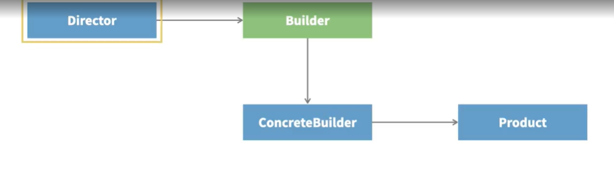

# Purpose
To avoid complex constructors.

# Workflow

-> Builder class - A separate class that is used to construct the object using
   just the fields that you require (to avoid complex constructors).
-> ConcreteBuilder class - Traditionally the builder class is an interface and a concrete implementation
   of it would be this class.
-> Product class - The class that would otherwise have a clumsy consrtuctor.
-> Director class - The class that uses the builder to create the object.

In Java, its possible to simplify and bypass the interface for the Builder class.

# Recognizing when to use builder pattern
When there's an object that has a lot of attributes and if they are bound to grow in size further, with time, the classes that instantiate the objects would take a hit.
And it could be that only a few attributes are mandatory and the rest of them are optional.
In this case, it would be hard to maintain the resulting code.
This is typically where Builder pattern is used as a solution.

# Resources
Bethan Palmer's course on design patterns in LinkedIn

